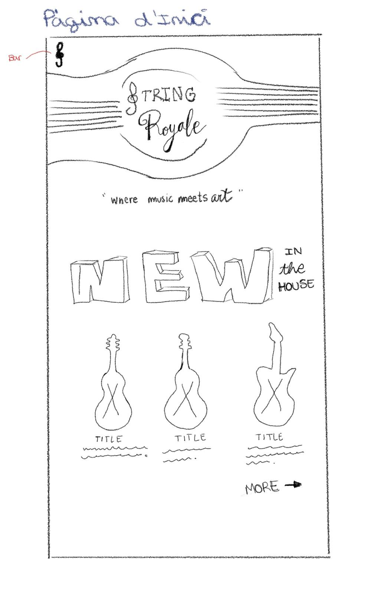
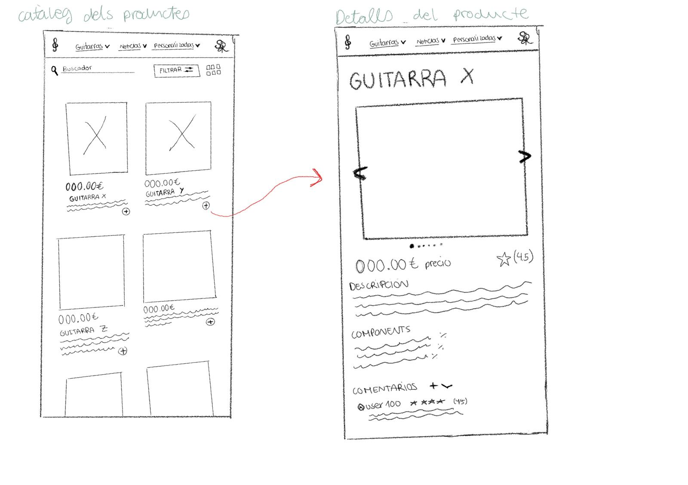
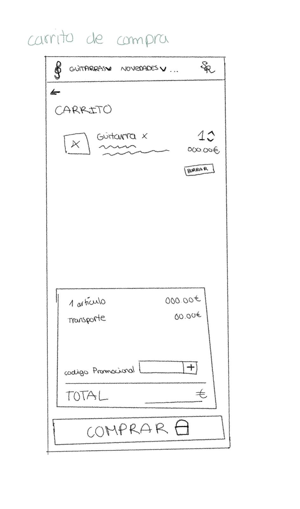
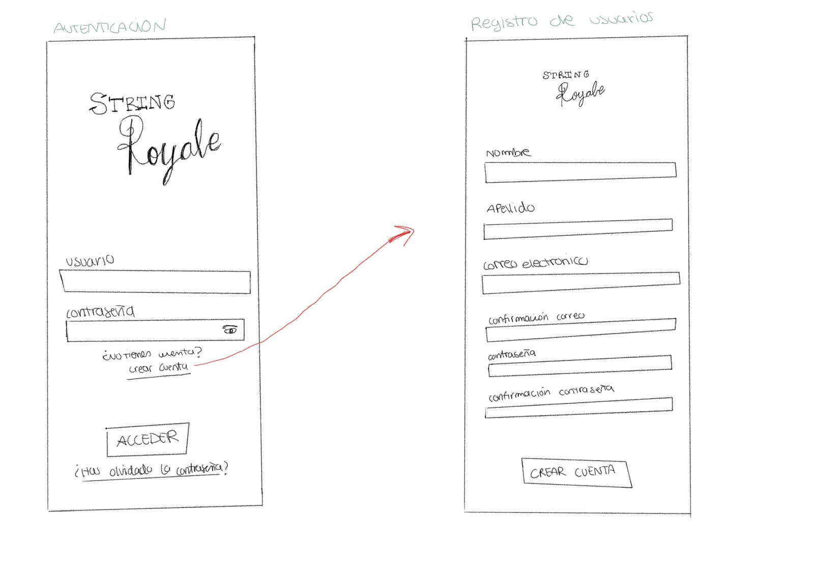
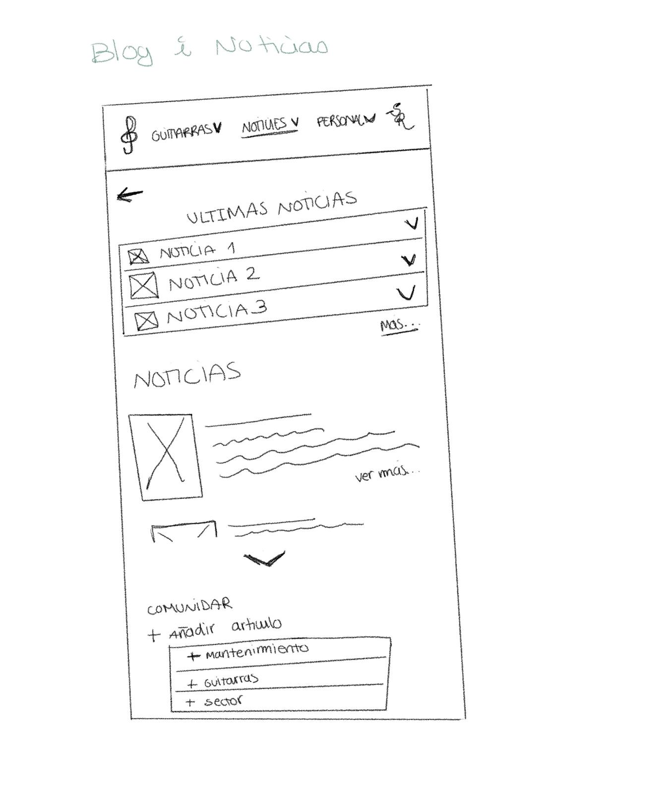

# P0_wireframe
# Tienda de Guitarras de Lujo

Una aplicación web diseñada para los amantes de las guitarras de lujo. Presentamos una experiencia de compra exclusiva con una selección de guitarras de alta gama y características premium. A continuación, se describen las secciones principales de la aplicación junto con imágenes de los wireframes.

## Páginas Principales

### 1. Páginas de Inicio
   - **Descripción**: Presentación de la tienda de guitarras de lujo. Se destacan los productos y secciones de la tienda con una interfaz visual atractiva.
   - **Contenido**:
     - Introducción a la tienda y su propuesta de valor.
     - Sección de destacados con imágenes y descripciones breves de las guitarras más exclusivas.
     - Enlace a la sección de productos para explorar todo el catálogo.

   
   *Wireframe de la Página de Inicio mostrando la presentación de la tienda y productos destacados.*

### 2. Catálogo de Productos
   - **Descripción**: Catálogo completo de guitarras disponibles con opciones de filtro y búsqueda.
   - **Contenido**:
     - Lista de guitarras con imágenes, descripciones detalladas, precios y opciones de personalización.
     - Filtro por marca, rango de precio y tipo de guitarra (eléctrica, acústica, clásica, etc.).

   
   *Wireframe del Catálogo de Productos, con opciones de filtro por marca, precio y tipo.*

### 3. Detalles del Producto
   - **Descripción**: Página dedicada a cada guitarra, mostrando todos sus detalles.
   - **Contenido**:
     - Imágenes de alta calidad de la guitarra.
     - Especificaciones técnicas, materiales, y características únicas.
     - Reseñas de clientes sobre el producto.
     - Formulario para insertar nuevos productos (disponible para administradores).

   *Wireframe de la Página de Detalles del Producto con imágenes, especificaciones y reseñas.*

### 4. Cistella de Compra
   - **Descripción**: Espacio donde se pueden añadir o eliminar productos de la cistella de compra.
   - **Contenido**:
     - Funcionalidad para gestionar los productos en la cistella.
     - Visualización del total y resumen de la compra.

   
   *Wireframe de la Cistella de Compra mostrando los productos seleccionados y el resumen.*

### 5. Autenticación y Registro de Usuarios
   - **Descripción**: Sistema de autenticación para usuarios registrados.
   - **Contenido**:
     - Formulario de registro y login de usuarios.
     - Opciones de recuperación de contraseña en caso de olvido.

   
   *Wireframe de la página de Registro y Login de usuarios.*

### 6. Noticias
   - **Descripción**: Sección dedicada a artículos sobre guitarras, mantenimiento y noticias del sector.
   - **Contenido**:
     - Publicación de artículos especializados sobre el mundo de las guitarras de lujo.
     - Consejos de mantenimiento, novedades en la industria y entrevistas a expertos.

   
   *Wireframe de la sección de Noticias, con artículos sobre guitarras y mantenimiento.*

## Funcionalidades Clave
- **Filtros avanzados**: Filtra por marca, tipo de guitarra, precio y más.
- **Gestión de productos**: Añadir, editar y eliminar productos para administradores.
- **Autenticación segura**: Sistema de registro, login y recuperación de contraseña.
- **Artículos informativos**: Noticias y consejos para los amantes de las guitarras de lujo.

